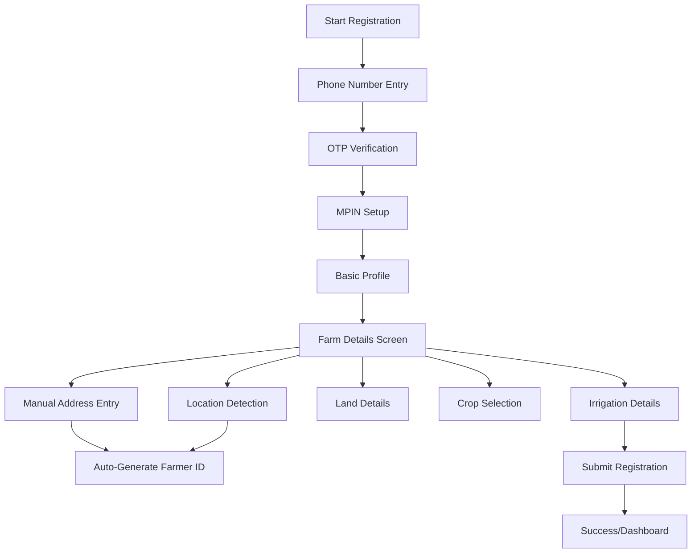

# CropFresh Farmers App - Registration Flow Documentation

## Table of Contents

1. [Overview](#overview)
2. [Registration Flow Architecture](#registration-flow-architecture)
3. [Step-by-Step Registration Process](#step-by-step-registration-process)
4. [Farmer ID Generation System](#farmer-id-generation-system)
5. [Farm Details Management](#farm-details-management)
6. [Technical Implementation](#technical-implementation)
7. [API Integration](#api-integration)
8. [Offline Capabilities](#offline-capabilities)
9. [Security Features](#security-features)
10. [Testing Guide](#testing-guide)

## Overview

The CropFresh Farmers App registration flow is a comprehensive multi-step system designed to onboard farmers efficiently while collecting essential agricultural data. The system emphasizes user experience, data quality, and offline capabilities suitable for rural environments.

### Key Features

- **3-Step Registration Process**: Phone/OTP → MPIN Setup → Basic Profile → Detailed Farm Information
- **Auto-Generated Farmer IDs**: Location-based unique identification system
- **GPS Integration**: Automatic farm location detection with manual override
- **Comprehensive Farm Details**: Land area, ownership, crops, irrigation systems
- **Offline Support**: Works without internet connectivity
- **Government Integration Ready**: Compatible with agricultural databases

## Registration Flow Architecture



### Component Architecture

```
lib/features/registration/
├── registration_flow.dart          # Main registration stepper
├── farm_details/
│   ├── farm_details_screen.dart    # Detailed farm information UI
│   ├── farm_details_controller.dart # Business logic & state management
│   ├── farm_details_repository.dart # API calls & offline storage
│   ├── models/
│   │   ├── farm_details.dart       # Farm data model
│   │   └── crop.dart              # Crop selection model
│   ├── services/
│   │   └── farmer_id_generator.dart # Farmer ID generation logic
│   └── demo/
│       └── farmer_id_demo.dart     # Demo examples
```

## Step-by-Step Registration Process

### Step 1: Phone Number & OTP Verification

**Purpose**: Verify farmer's identity and contact information

**Components**:
- Phone number input with validation
- OTP generation and verification
- Success feedback with SnackBar messages

**User Experience**:
```
┌─────────────────────────────────────┐
│ Enter Phone Number                  │
│ ┌─────────────────────────────────┐ │
│ │ +91 9876543210                  │ │
│ └─────────────────────────────────┘ │
│ [Send OTP]                          │
│                                     │
│ Enter OTP:                          │
│ ┌─┐ ┌─┐ ┌─┐ ┌─┐ ┌─┐ ┌─┐            │
│ │1│ │2│ │3│ │4│ │5│ │6│            │
│ └─┘ └─┘ └─┘ └─┘ └─┘ └─┘            │
│ [Verify OTP]                        │
└─────────────────────────────────────┘
```

**Technical Implementation**:
- Auto-focus progression between OTP fields
- Input validation and error handling
- Mock OTP service (ready for real SMS integration)

### Step 2: MPIN Setup

**Purpose**: Secure app access with 4-digit PIN

**Components**:
- 4-digit MPIN input
- MPIN confirmation
- Visual feedback for security

**User Experience**:
```
┌─────────────────────────────────────┐
│ Enter MPIN (4 digits):              │
│ ┌─┐ ┌─┐ ┌─┐ ┌─┐                    │
│ │●│ │●│ │●│ │●│                    │
│ └─┘ └─┘ └─┘ └─┘                    │
│                                     │
│ Re-enter MPIN:                      │
│ ┌─┐ ┌─┐ ┌─┐ ┌─┐                    │
│ │●│ │●│ │●│ │●│                    │
│ └─┘ └─┘ └─┘ └─┘                    │
└─────────────────────────────────────┘
```

### Step 3: Basic Profile Information

**Purpose**: Collect essential farmer details

**Fields**:
- Full Name (required)
- Experience Level (Beginner/Intermediate/Advanced)
- Auto-generated Farmer ID notification

**User Experience**:
```
┌─────────────────────────────────────┐
│ Full Name: [John Doe]               │
│ Experience Level: [Intermediate ▼]  │
│                                     │
│ ℹ️ Farmer ID will be auto-generated │
│   based on your farm location       │
│                                     │
│ [Next: Farm Details]                │
└─────────────────────────────────────┘
```

### Step 4: Detailed Farm Information

**Purpose**: Comprehensive farm data collection

This transitions to the dedicated Farm Details Screen with multiple sections.

## Farmer ID Generation System

### ID Format Standards

**Location-Based Format**: `STATE-DISTRICT-TEHSIL-YYYYMM-XXXX`
- Example: `MH-PUN-HAV-202506-3390`
- Components:
  - `MH`: Maharashtra state code
  - `PUN`: Pune district code  
  - `HAV`: Haveli tehsil code
  - `202506`: Year 2025, Month 06
  - `3390`: Unique sequence number

**GPS-Based Format**: `GPS-LAT-LNG-YYYYMM-XXXX`
- Example: `GPS-IGY-1DE-202506-3776`
- Used when detailed address unavailable

**Fallback Format**: `CF-GEN-TMP-YYYYMM-XXXX`
- Temporary ID for minimal data scenarios

### Generation Logic

```dart
// Location-based generation
final farmerId = FarmerIdGenerator.generateFarmerId(
  state: 'Maharashtra',
  district: 'Pune', 
  tehsil: 'Haveli',
  village: 'Pirangut',
  phoneNumber: '9876543210',
);

// GPS-based generation  
final gpsId = FarmerIdGenerator.generateGpsBasedFarmerId(
  latitude: 18.5204,
  longitude: 73.8567,
  phoneNumber: '9876543210',
);
```

### State & District Code Mapping

The system includes comprehensive mapping for:
- **36 Indian States/UTs**: All states with standard abbreviations
- **80+ Major Districts**: Common districts with 3-letter codes
- **Auto-fallback**: Generates codes for unmapped locations

### Benefits

✅ **Uniqueness**: Location + timestamp + phone ensures no duplicates
✅ **Location Intelligence**: Region identifiable from ID
✅ **Government Ready**: Compatible with agricultural databases  
✅ **Scalable**: Supports millions of farmers
✅ **Offline**: Works without internet
✅ **Traceable**: Registration date embedded

## Farm Details Management

### Location Section

**GPS Auto-Detection**:
```
┌─────────────────────────────────────┐
│ 📍 Farm Location                    │
│ [📡 Get GPS Location]               │
│                                     │
│ ✅ Location Detected                │
│ Mock Farm Location, New Delhi       │
│ Lat: 28.613900, Lng: 77.209000     │
└─────────────────────────────────────┘
```

**Manual Address Entry**:
```
┌─────────────────────────────────────┐
│ Manual Address (Optional)           │
│                                     │
│ Village/Area: [Pirangut]            │
│ Tehsil/Taluk: [Haveli] District: [Pune] │
│ State: [Maharashtra] PIN: [412115]  │
│                                     │
│ 📋 Address Preview:                 │
│ Pirangut, Haveli, Pune, Maharashtra, 412115 │
└─────────────────────────────────────┘
```

### Land Details Section

**Components**:
- Land area input with unit selection (hectares/acres)
- Visual size reference ("Medium plot - 1-2 football fields")
- Ownership type dropdown
- Form validation

**Land Area Reference System**:
- **Hectares**:
  - < 0.5: Small plot (less than half football field)
  - 0.5-2: Medium plot (1-2 football fields)  
  - 2-10: Large plot (2-10 football fields)
  - > 10: Very large farm
- **Acres**: Similar scaling for acre measurements

### Crop Selection System

**Multi-Select Interface**:
```
┌─────────────────────────────────────┐
│ 🌾 Primary Crops (3 selected)       │
│                                     │
│ ▼ Cereals                           │
│   [Rice] [Wheat] [Maize] [Barley]   │
│                                     │  
│ ▼ Vegetables                        │
│   [Tomato] [Onion] [Potato]         │
│                                     │
│ ▼ Fruits                            │
│   [Mango] [Banana] [Apple]          │
└─────────────────────────────────────┘
```

**Crop Categories**:
- Cereals (Rice, Wheat, Maize, Barley, Millet)
- Pulses (Chickpea, Lentil, Black Gram, Green Gram)
- Vegetables (Tomato, Onion, Potato, Cabbage, etc.)
- Fruits (Mango, Banana, Apple, Orange, Grapes)
- Cash Crops (Cotton, Sugarcane, Tobacco)
- Oil Seeds (Groundnut, Sunflower, Mustard, Sesame)
- Spices (Turmeric, Chili, Coriander, Cumin)

### Irrigation Details

**Irrigation Types**:
- Drip Irrigation
- Sprinkler
- Flood Irrigation  
- Rainfed
- Other

**Water Sources**:
- Borewell
- Canal
- River
- Pond
- Rainwater Harvesting
- Other

## Technical Implementation

### State Management

**Architecture**: ChangeNotifier pattern (upgradeable to Riverpod)

```dart
class FarmDetailsController extends ChangeNotifier {
  // Form state management
  FarmDetailsState _state = FarmDetailsState.initial;
  
  // Location data
  double? _latitude;
  double? _longitude;
  String _address = '';
  
  // Detailed address fields
  String _village = '';
  String _district = '';
  String _addressState = '';
  
  // Auto-generate farmer ID when data available
  void generateFarmerId() { /* ... */ }
}
```

### Data Models

**FarmDetails Model**:
```dart
class FarmDetails {
  // Basic info
  final String phoneNumber;
  final String fullName; 
  final String farmerId;
  
  // Location
  final double latitude;
  final double longitude;
  final String address;
  
  // Detailed address
  final String? village;
  final String? district;
  final String? addressState;
  
  // Farm data
  final double landArea;
  final String ownershipType;
  final List<String> primaryCrops;
  final String irrigationType;
}
```

### Repository Pattern

**API & Offline Management**:
```dart
class FarmDetailsRepository {
  Future<bool> submitFarmDetails(FarmDetails farmDetails) async {
    try {
      // Try API submission
      final success = await _submitToApi(farmDetails);
      if (success) return true;
    } catch (e) {
      // Fallback to offline storage
      await _saveOfflineData(farmDetails);
      return false; // Indicates offline mode
    }
  }
}
```

## API Integration

### Endpoints

**Farm Details Submission**:
```
POST /api/farmer/farm-details
Content-Type: application/json

{
  "phoneNumber": "9876543210",
  "fullName": "John Doe",
  "farmerId": "MH-PUN-HAV-202506-3390",
  "latitude": 18.5204,
  "longitude": 73.8567,
  "address": "Mock Farm Location",
  "village": "Pirangut",
  "district": "Pune", 
  "addressState": "Maharashtra",
  "landArea": 2.5,
  "landAreaUnit": "hectares",
  "ownershipType": "Owner",
  "primaryCrops": ["rice", "wheat", "tomato"],
  "irrigationType": "Drip Irrigation",
  "irrigationSource": "Borewell",
  "createdAt": "2025-06-01T10:30:00Z"
}
```

**Crop Data Loading**:
```
GET /api/crops?region=maharashtra
Response: Array of crop objects with regional availability
```

### Error Handling

- Network failure: Automatic offline storage
- Validation errors: User-friendly error messages  
- API errors: Retry mechanism with exponential backoff
- Data sync: Background sync when connection restored

## Offline Capabilities

### Local Storage Strategy

**SharedPreferences Keys**:
- `offline_farm_details`: Cached farm data
- `cached_crops`: Available crop list
- `last_sync_timestamp`: Sync tracking

**Offline Flow**:
1. User fills form without internet
2. Data stored locally with `isOfflineData: true`
3. Visual indicator shows offline status
4. Auto-sync when connectivity restored
5. Success notification on sync completion

### Sync Management

```dart
Future<bool> syncOfflineData() async {
  final offlineData = await getPendingOfflineData();
  if (offlineData != null && await _isNetworkAvailable()) {
    final success = await _submitToApi(offlineData);
    if (success) await _clearOfflineData();
    return success;
  }
  return false;
}
```

## Security Features

### Data Protection

✅ **Input Validation**: All user inputs sanitized and validated
✅ **Location Privacy**: GPS coordinates handled securely
✅ **Farmer ID Security**: No sensitive data in ID format
✅ **API Security**: HTTPS, authentication headers, request encryption
✅ **Local Storage**: Sensitive data encrypted before storage

### Privacy Considerations

- GPS coordinates stored only with explicit consent
- Phone numbers handled according to privacy regulations
- Farmer data anonymizable for analytics
- GDPR compliance ready architecture

## Testing Guide

### Unit Tests

**Farmer ID Generation**:
```dart
test('should generate valid location-based farmer ID', () {
  final id = FarmerIdGenerator.generateFarmerId(
    state: 'Maharashtra',
    district: 'Pune',
    tehsil: 'Haveli',
  );
  expect(FarmerIdGenerator.isValidFarmerId(id), true);
  expect(id, startsWith('MH-PUN-HAV'));
});
```

**Form Validation**:
```dart
test('should validate required farm details', () {
  final controller = FarmDetailsController();
  controller.updateLandArea(0.0);
  expect(controller.isFormValid, false);
  
  controller.updateLandArea(2.5);
  expect(controller.isFormValid, true);
});
```

### Widget Tests

**Registration Flow**:
```dart
testWidgets('should navigate through registration steps', (tester) async {
  await tester.pumpWidget(MyApp());
  
  // Test phone number entry
  await tester.enterText(find.byType(TextField), '9876543210');
  await tester.tap(find.text('Send OTP'));
  await tester.pump();
  
  // Verify OTP screen
  expect(find.text('Enter OTP:'), findsOneWidget);
});
```

### Integration Tests

**Complete Registration Flow**:
```dart
testWidgets('complete registration flow integration', (tester) async {
  // Test full user journey from start to success
  await tester.pumpWidget(MyApp());
  
  // Phone & OTP
  await _completePhoneVerification(tester);
  
  // MPIN setup  
  await _completeMpinSetup(tester);
  
  // Basic profile
  await _completeBasicProfile(tester);
  
  // Farm details
  await _completeFarmDetails(tester);
  
  // Verify success screen
  expect(find.text('Registration Complete!'), findsOneWidget);
});
```

## Performance Optimizations

### UI Performance

- **Lazy Loading**: Crop list loaded asynchronously
- **Debounced Input**: Address fields with debounced updates  
- **Efficient Rebuilds**: Targeted widget rebuilds with ChangeNotifier
- **Image Optimization**: Compressed assets for fast loading

### Memory Management

- **Controller Disposal**: Proper cleanup of controllers and listeners
- **Cache Management**: Limited crop data cache with expiration
- **Background Processing**: Heavy operations on background isolates

## Future Enhancements

### Planned Features

1. **Map Integration**: Visual farm boundary marking
2. **Biometric Auth**: Fingerprint/face authentication  
3. **Multi-language**: Regional language support
4. **Voice Input**: Voice-to-text for address entry
5. **Document Upload**: Land ownership document scanning
6. **Family Members**: Multiple farmer profiles per household

### Scalability Roadmap

1. **Microservices**: Split into focused services
2. **GraphQL**: Efficient data fetching
3. **Real-time Sync**: WebSocket-based live updates
4. **Analytics**: Farmer registration insights
5. **AI Integration**: Smart crop recommendations

---

## Conclusion

The CropFresh registration flow represents a comprehensive, user-friendly, and technically robust solution for farmer onboarding. With its emphasis on offline capabilities, auto-generated IDs, and detailed farm information collection, it provides an excellent foundation for agricultural technology applications.

The system is designed to scale from small farming communities to large agricultural cooperatives while maintaining data quality and user experience standards suitable for rural environments.

For technical support or implementation questions, refer to the inline code documentation and component-specific README files. 